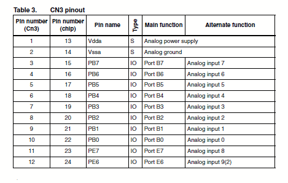
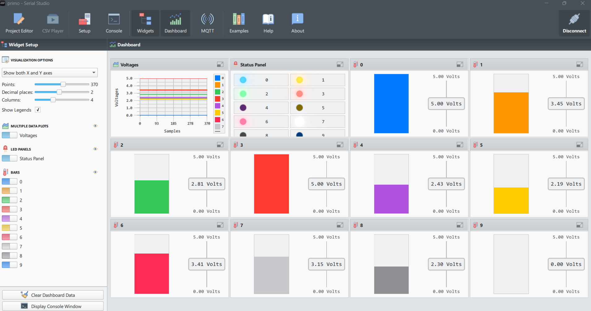
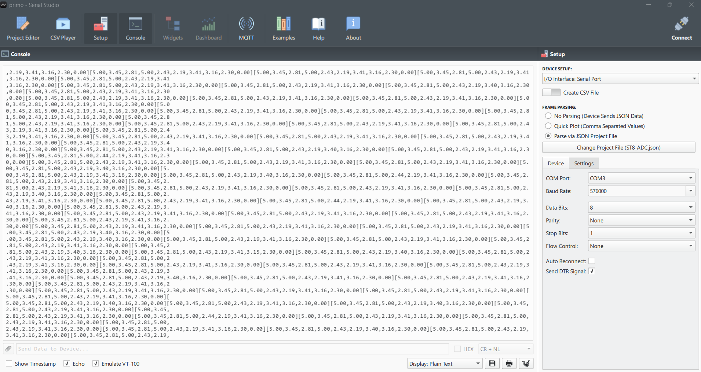
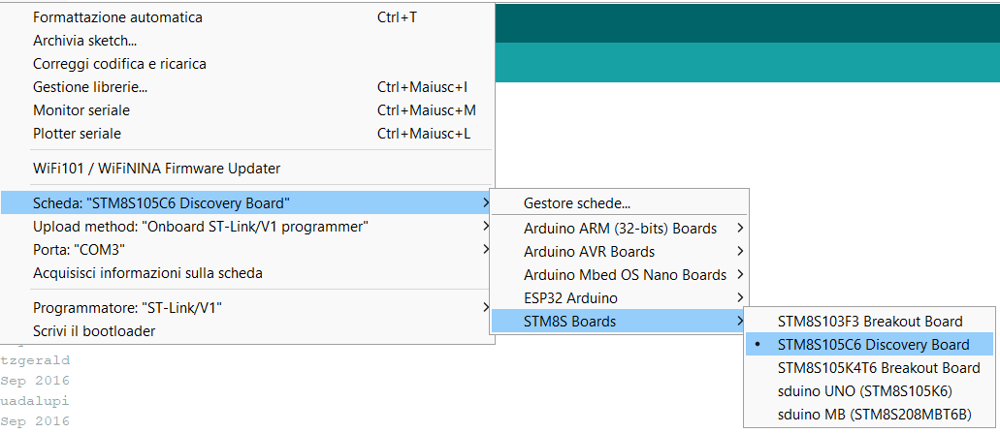
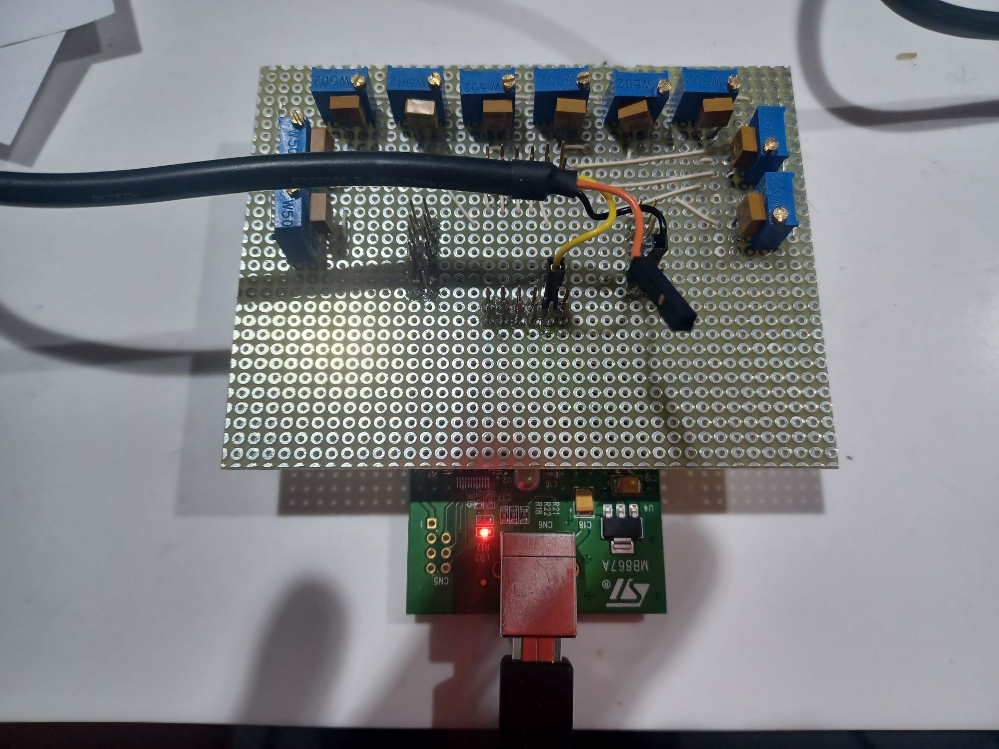
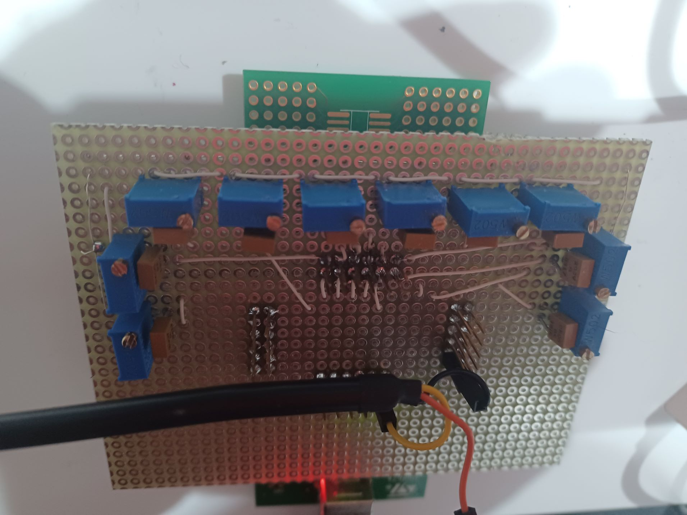

# STM8S105C6DBSerialStudio
## An Arduino project for plot STM8S105C6 Discovery Board adc data with [Serial Studio](https://serial-studio.github.io/).

You must install the STM8S Boards from https://raw.githubusercontent.com/tenbaht/sduino/master/package_sduino_stm8_index.json

The serial out is fom pin 

The adc pins are:

TX CN4 10
GND CN1 4

The adc imputs are on CN3:

